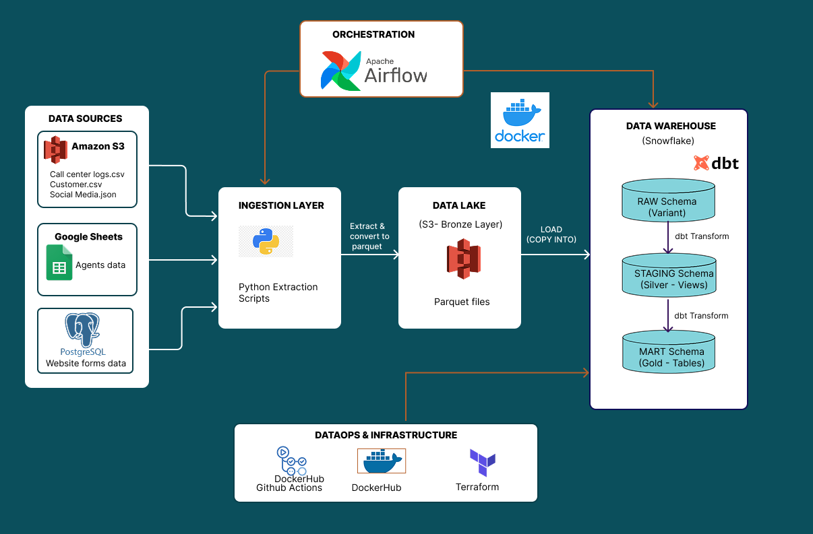
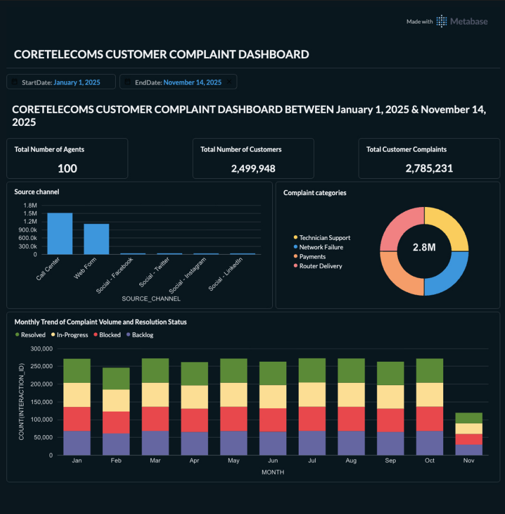

# CoreTelecoms: Customer Experience Data Platform

## Project Overview

**CoreTelecoms** faces a customer retention challenge due to fragmented data across Call Centers, Website Forms, and Social Media. This project implements a Modern Data Platform to unify these disparate sources into a Single Source of Truth.

This platform automates the End-to-End lifecycle: 

**Ingestion** $\rightarrow$ **Data Lake** $\rightarrow$ **Warehouse** $\rightarrow$ **Transformation**

## Architecture



## Data Flow

1. **Ingestion**: Python scripts running in **Docker and Airflow** extract data from AWS S3 (CSVs, JSON), Google Sheets, and Postgres.
2. **Data Lake**: Raw data is stored in **AWS S3** in Parquet format (partitioned and compressed).
3. **Warehousing**: Data is loaded into Snowflake using the `COPY INTO` command (Variant Pattern).
4. **Transformation**: dbt processes data through a Medallion Architecture (**Bronze** $\rightarrow$ **Silver** $\rightarrow$ **Gold**).
5. **Orchestration**: Apache Airflow schedules and manages dependencies between ingestion and transformation tasks.
6. **CI/CD**: GitHub Actions performs **linting** and auto-deploys the Airflow Docker image to **Docker Hub**. 

## Tech Stack
| Category | Tool &nbsp;| Purpose_______________|
|:---|:---|:---|
| **Cloud Provider**    | AWS | S3 Data Lake, IAM (Security) & SSM (Secrets) |
| **IaC** | Terraform | Infrastructure Provisioning (S3 Bucket, Snowflake DBs, IAM Roles, Networking) |
| **Orchestration** | Apache Airflow | Managing DAGs (Static & Daily Incremental) |
| **Ingestion** | Python | Extraction from S3 buckets, google sheets & databases |
| **Containerization** | Docker & Docker Compose | encapsulating the Python runtime |
| **Warehouse** | Snowflake | Storage and Compute Engine |
| **Transformation** | dbt | Data Modeling, Testing & Documentation |
| **CI/CD** | GitHub Actions | Automated Deployment to Docker Hub |


## Project Structure
```
    ├── dags/                        # Airflow DAGs (Static & Daily pipelines)
    ├── dbt/                         # dbt Project (Models, Tests, Seeds)
    │   ├── models/
    │   │   ├── staging/             # Silver Layer (Cleaning & Standardization)
    │   │   └── marts/               # Gold Layer (Dimensional Modeling)         
    │   └── macros/ 
    │       
    ├── scripts/                    
    │   ├── common/                  # Shared Utilities (AWS Client, Config)
    │   ├── extract/                 # Ingestion Scripts (S3, GSheets, Postgres)
    │   └── load/                    # Snowflake Loading Scripts
    │ 
    ├── terraform/ 
    │     ├── aws.tf                 # Setup for S3, IAM & SSM
    │     ├── gcp.tf                 # Setup service account for gspread
    │     └── snowflake.tf           # Setup for snowflake wh and networking with aws
    │
    ├── .github/workflows/           # CI/CD Definition
    ├── docker-compose.yaml          # Airflow Installation
    ├── Dockerfile                   
    ├── requirements.txt             
    └── README.md                    
```

### Key Features
1. **Robust Data Ingestion**
    - **Incremental Loading**: The pipeline checks existing files in S3 and only processes new data from Postgres and Call Logs.
    - **Idempotency**: The pipeline can be re-run multiple times without creating duplicate data in the Warehouse.
    - **Variant Loading**: Data is loaded into Snowflake as VARIANT (JSON) first, making the pipeline resilient to schema changes

2. **Medallion Architecture (dbt)**
    - **Bronze (RAW)**: 1:1 copy of source data.
    - **Silver (STAGING)**: Cleaned data. Fixes email typos (e.g., gmail.om), parses dates, and standardizes column names.
    - **Gold (MARTS)**: Star Schema.
       - `FACT_CUSTOMER_COMPLAINTS`: UNIONed all three customer interaction sources (Call, Web, Social) into a single analytical view, normalizing metrics across channels.
       - `DIM_CUSTOMERS`: Master customer profile with calculated tenure_days.
       - `DIM_AGENTS` : Agents data

3. **Data Quality & Security**
    - **Data Cleaning**:
        - Customers: Corrected email typos using Regex (e.g., 'GmaiL.om' $\rightarrow$ gmail.com e.t.c).
        - Web&Social: Handled empty strings in resolution date fields using `TRY_TO_TIMESTAMP`.
        - Renaming: Standardized messy headers (e.g., 'COMPLAINT_catego ry' $\rightarrow$ complaint_category)
    
    - **Data Contracts**: dbt tests to ensure unique IDs, not_null constraints, and referential integrity between Complaints, Customers and Agents

    - Security: No hardcoded secrets. All credentials are managed via AWS SSM Parameter Store or injected via .env in Docker.
    
    
## How to Run Locally 
**Prerequisites**
- Docker & Docker Compose
- AWS Service Account
- GCP Service Account
- Terraform
- .env

**Step 1: Infrastructure Setup**
Initialize the cloud resources
```bash
    cd terraform

    terraform init
    terraform plan
    terraform apply
```
**Step 2: Configuration**
Create a .env file in the root directory

```Ini, TOML
AIRFLOW_UID=
SOURCE_AWS_ACCESS_KEY_ID=
SOURCE_AWS_SECRET_ACCESS_KEY=
SOURCE_DATA_LAKE=

SOURCE_AGENTS_SHEET_ID=
GOOGLE_CREDENTIALS_PATH=

WEBSITE_FORM_DB_NAME=
WEBSITE_FORM_DB_HOST=
WEBSITE_FORM_DB_PASSWORD=
WEBSITE_FORM_DB_USER=
WEBSITE_FORM_DB_SCHEMA=
WEBSITE_FORM_DB_PORT=

DESTINATION_DATA_LAKE=
DESTINATION_AWS_ACCESS_KEY_ID=
DESTINATION_AWS_SECRET_ACCESS_KEY=
SNOWFLAKE_USER=
SNOWFLAKE_PASSWORD=
SNOWFLAKE_ACCOUNT=
SNOWFLAKE_WAREHOUSE=
SNOWFLAKE_ROLE=
CORETELECOMS_DATABASE=
```

**Step 3: Start Airflow**
Build the custom image and start the containers.

```Bash
    docker-compose up -d --build
``` 
**Step 4: Trigger Pipelines**
Access Airflow at http://localhost:8080 (User/Pass: `airflow`).
1. Run `coretelecoms_ingestion_static_1` (Once). (This ingests the customer and agents data, has to be manually triggered)
2. Enable `coretelecoms_ingestion_daily_1` (Scheduled).

### Insights

I built a simple dashboard using Metabase with the Gold Layer of the Pipeline.


#### Recommendation to Management:
1. Implement Automation: Since volume is high across all complaint categories, deploy a Chatbot or Self-Service Portal to handle L1 tickets (e.g., "Network Failure", "Payments") to free up agents.

2. Focus on Blocked and Backlogged Tickets: Investigate why so many tickets are stuck. Are agents waiting on Engineering? If so, the SLA between Support and Engineering needs review.

3. Surge Staffing: The backlog is too high. CoreTelecoms needs to hire temporary agents to clear the existing Unresolved queue to bring the ratio to a healthy split.